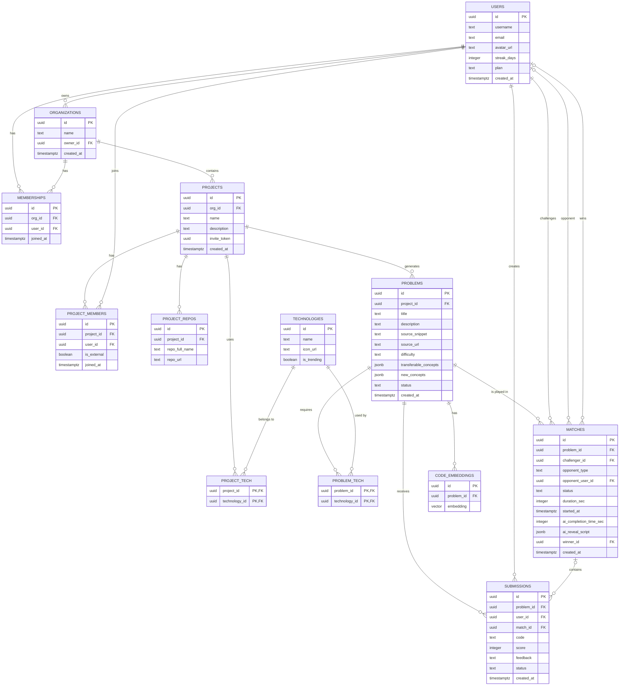

# Fara

## Nombre y descripción

Fara es una plataforma agéntica que convierte el código que un desarrollador ya escribió en ejercicios prácticos adaptativos para aprender un nuevo stack tecnológico. En lugar de empezar "desde cero", el usuario reconstruye lo que ya sabe hacer, pero en la tecnología que necesita dominar.

### El problema

Los desarrolladores tienen que aprender nuevos lenguajes y frameworks todo el tiempo (migraciones de stack, cambios de equipo, nuevas exigencias del mercado). El método estándar para aprender sigue siendo el mismo: tutoriales genéricos y proyectos de práctica que no tienen nada que ver con la experiencia real de la persona.

Esto genera dos problemas concretos:

* **Fricción innecesaria**: se vuelve a explicar/practicar conceptos que el desarrollador ya domina, solo que en otro lenguaje.
* **Desconexión con la experiencia real**: ninguna plataforma (Udemy, Pluralsight, LinkedIn Learning, roadmap.sh) parte del código que la persona ya construyó.

Datos que respaldan el problema:

* Según el Future of Jobs Report del World Economic Forum (WEF), el 39% de las habilidades clave en tecnología cambiará en los próximos años.
* El WEF tambien estima que **59 de cada 100 trabajadores** necesitarán reskilling o upskilling antes de 2030, y el **63% de los empleadores** ve las brechas de habilidades como la principal barrera para transformar sus organizaciones.
* Según reportes de Developer Experience (Atlassian DevEx), el 69% de los ingenieros pierde 8+ horas por semana en ineficiencias de contexto y reacondicionamiento técnico.
* LinkedIn reporta que el **49%** de los líderes de aprendizaje y talento dice que sus ejecutivos están preocupados porque los empleados no tienen las habilidades para ejecutar la estrategia del negocio.
* La tasa de finalización de cursos MOOC gratuitos (Coursera, edX, Udemy) ronda apenas el **15-20%**, pese a tener decenas de millones de usuarios inscritos: el acceso al contenido no es el problema, terminarlo y aplicarlo sí.
* Según la Encuesta de Desarrolladores 2025 de Stack Overflow, el **68%** de los desarrolladores prefiere ir directo a la documentación técnica antes que a tutoriales o cursos en video: buscan resolver *su* problema real, no seguir una ruta genérica.

El problema de fondo no es la falta de contenido educativo (sobra), sino la falta de un puente entre lo que el profesional ya sabe hacer y la tecnología nueva que necesita incorporar.

*Fuentes: [World Economic Forum – Future of Jobs Report 2025](https://www.weforum.org/publications/the-future-of-jobs-report-2025/) · [LinkedIn – Workplace Learning Report 2025](https://learning.linkedin.com/resources/workplace-learning-report) · [Stack Overflow Developer Survey 2025](https://survey.stackoverflow.co/2025/)*

### Usuario objetivo

Profesionales de software (principalmente junior) que necesitan adquirir rápidamente una tecnología nueva por:

* Migración de stack en su equipo actual.
* Cambio de equipo o de proyecto.
* Nuevas exigencias del mercado laboral.

Perfil Junior: 
* Dominio real de al menos 1 stack tecnológico completo (ej. Python + DJango)
* Conocimiento superficial o nulo de la tecnología a la que desea migrar. 
* Con proyectos o repos propios (min. 5)

### Usuario objetivo
**Model: B2C**

Free: 
- Limite de hasta 3 proyectos. 
- Limite de hasta 3 organizacione.
- Número de tecnologías por proyectos. 
- Solo 1 participante por organización
- Tecnologías limitadas

Premium: 
- Número ilimitado de proyectos que puedes crear
- Numero ilimitado de organizaciones.
- 9 de tecnologías por proyectos. 
- Número ilimitado de participantes por organizaciones 
- Acceso a tecnologias nuevas. 


### MVP

El MVP se enfoca en **una sola cosa**: transformar código real del usuario en un ejercicio equivalente en la tecnología objetivo.

1. **Entrada**: el usuario conecta su cuenta de GitHub. El agente revisa sus repositorios y proyectos para encontrar fragmentos de código que sirvan como base para aprender la tecnología objetivo.
2. **Matching**: un agente identifica qué parte de ese código tiene potencial de traducirse a la tecnología objetivo (análisis estructural + embeddings + comparación semántica).
3. **Generación del ejercicio**: se genera el mismo problema, pero en la tecnología nueva, señalando explícitamente:
   - qué conceptos son **transferibles** (ej. lógica de negocio, diseño de la API), y
   - qué conceptos son **genuinamente nuevos** (ej. manejo de concurrencia).
4. **Modo versus (diferencial)**: el usuario resuelve el ejercicio compitiendo en tiempo real contra un miembro de su organización.


## Stack Tecnológico 

### Resumen

| Capa | Tecnología | Motivo |
|---|---|---|
| Frontend | Next.js (ya inicializado) | Decisión previa del equipo |
| Editor de código | Monaco Editor | El mismo editor de VS Code, syntax highlighting listo, integración simple en React |
| Backend | FastAPI (Python) | Async nativo, tipado con Pydantic, coherente con el ecosistema de IA |
| Base de datos | Supabase (Postgres) | Ya decidido por el equipo |
| Auth | Supabase Auth | Incluido con Supabase, soporta Google/GitHub tal como el wireframe de landing |
| Realtime / notificaciones | Supabase Realtime | Evita construir WebSockets propios para "Generating..." y el modo Fight |
| Vector store | Postgres + pgvector (extensión de Supabase) | No se suma un vector DB aparte; se aprovecha la misma instancia de Supabase |
| LLM orquestador | Gemini 2.0 Flash (tier gratuito) | Análisis de repos y generación de problemas; contexto largo, costo cero para la demo |
| LLM evaluación/versus (si hay créditos) | Claude o GPT como opción superior; Gemini como fallback | Mejor razonamiento sobre código para feedback y solución progresiva del modo Fight |
| Sandbox de ejecución de código | Piston API (pública) | Ejecución real multi-lenguaje sin infraestructura propia |
| Testing backend | Pytest | Requisito obligatorio de las bases (suite de pruebas automáticas) |
| Deploy backend | Railway o Render | Deploy desde GitHub en minutos |
| Deploy frontend | Vercel | Estándar para Next.js |
| Control de versiones | GitHub | Requisito de la organización (Releases obligatorios) |

---

### Backend: FastAPI (Python)

Elegido por sobre Django/Flask porque:
- Async nativo, necesario para llamadas a LLM y a Piston que no son instantáneas.
- Validación de datos con Pydantic, útil para el JSON estructurado que devuelven los prompts.
- WebSockets/SSE integrados si se necesitan además de Supabase Realtime.
- Menor fricción de setup que Django para el tiempo disponible.

### Base de datos: Supabase (Postgres)

- Se usa `pgvector` como extensión de la misma instancia en lugar de sumar Pinecone/Weaviate/Chroma — un solo lugar de datos, una sola conexión.
- Supabase Auth resuelve el login social (Google/GitHub) que pide el wireframe de landing sin backend propio de autenticación.
- Supabase Realtime reemplaza la necesidad de levantar WebSockets propios para:
  - Notificar cuando termina la generación de problemas ("Generating your problems...").
  - Sincronizar estado y timer entre dos usuarios en el modo Fight.



### LLM orquestador

**Gemini 3.6 Flash** para el análisis de repos y generación de problemas:
- Tier gratuito generoso, suficiente para la demo.
- Contexto largo, permite mandar varios archivos de código en un solo prompt sin necesidad de embeddings/RAG para el volumen de una demo.

**Claude o GPT (si hay créditos disponibles)** para evaluación de submissions y generación de la solución progresiva del modo Fight, donde la calidad del razonamiento sobre código importa más. Gemini queda como fallback si no hay créditos.

No se usan frameworks de agentes (LangChain, CrewAI). Se implementan 3 funciones especializadas orquestadas directamente desde el backend:
1. `analizar_repo()` — matching + generación de problemas en un solo prompt.
2. `generar_solucion_progresiva()` — solución con errores deliberados para el modo Fight.
3. `evaluar_submission()` — score + feedback usando el resultado real de ejecución.

### Sandbox de ejecución: Piston API

- API pública gratuita, ejecuta código en +40 lenguajes en contenedores aislados.
- Infraestructura propia de contenedores.
- Usada tanto en modo Code como en modo Fight.

### Testing

- **Pytest** en el backend, cubriendo al menos:
  - Camino feliz: submission correcta → score alto.
  - Caso de error: código que falla en ejecución → manejo correcto sin caída del servicio.

### Deploy

- **Backend:** Render
- **Frontend:** Vercel
- **URL:**

## Setup Local

Requisitos del frontend: Node.js 20 o superior y npm.

Clona el repositorio, instala las dependencias y levanta el frontend:

```bash
git clone <https://github.com/devrenato56/fara-project.git>
cd fara-project
npm ci
npm run dev
```
Abre [http://localhost:3000](http://localhost:3000).

### Backend

Requisitos: Python 3.10 o superior.

En otra terminal, desde la raíz del repositorio, ejecuta:

```powershell
cd backend
py -m venv .venv
.\.venv\Scripts\Activate.ps1
pip install -r requirements.txt
uvicorn app.main:app --reload
```

El backend estará disponible en:

- API: [http://localhost:8000](http://localhost:8000)
- Health check: [http://localhost:8000/health](http://localhost:8000/health)
- Documentación Swagger: [http://localhost:8000/docs](http://localhost:8000/docs)

Las variables opcionales de Supabase y Gemini pueden configurarse en `backend/.env`.


## Integrantes & Roles: 
- Renato -- Developer
- Tom -- Developer
- Pamela -- Developer
- Chris -- Developer


