# FARA — Arquitectura del Sistema (v5)

Documento técnico derivado de los wireframes, la propuesta de valor y los planes de precio.
Todos los diagramas están en Mermaid y renderizan directamente en GitHub.

Cambios de fondo vs. v4:
- **`ProjectMember` distingue miembros de la `Organization` de externos**: al armar el equipo de un proyecto, se puede elegir entre los miembros existentes de la organización o invitar a alguien externo — pero ese externo debe quedar explícitamente marcado como tal (`isExternal`).

Cambios de fondo acumulados desde v3:
1. `Organization` es real: un usuario puede pertenecer a varias, sin roles.
2. `Problem` ↔ `Technology` es muchos-a-muchos ("Adaptable a").
3. El equipo de un proyecto (`ProjectMember`) puede mezclar miembros de la organización y externos identificados.

Supuesto que se mantiene: el billing (`Subscription`) sigue siendo por `User` individual, no por `Organization`, consistente con el modelo B2C freemium de la propuesta.

---

## 0. Alcance Fase 1 vs. Arquitectura objetivo

| Componente | Fase 1 (hoy) | Objetivo (post-hackathon) |
|---|---|---|
| Servicios backend | Monolito único (módulos internos) | Microservicios independientes |
| Búsqueda semántica de código | `pgvector` dentro de Postgres | Vector DB dedicada |
| Ejecución de código | Runner externo (Piston/Judge0) o contenedor único | Sandbox propio con aislamiento de red |
| Organización (multi-tenant) | `Organization` + `Membership` real, sin roles; un usuario puede pertenecer a varias; cada `Project` pertenece a una `Organization` | Roles dentro de la organización, billing por organización |
| Colaboración en un proyecto (fights) | `ProjectMember` vía enlace de invitación, independiente de `Organization` | Vincular ambos conceptos si el negocio lo requiere |
| `Problem` → `Technology` | Muchos a muchos ("Adaptable a") | — |
| Modo Fight | Vs. IA y vs. Humano, ambos en vivo | Matchmaking automático, ranking |
| Community / News | Fuera de alcance | Backlog |
| Object Storage separado | No — código como columna en Postgres | Object Storage si el volumen lo justifica |
| Billing | Flag de plan en `User` (NPC / Giga Chad) | Servicio de billing completo, evaluar si pasa a nivel de Organization |

---

## 1. Mapa de navegación

```mermaid
flowchart LR
    ORG{{"Renato's org ▾"<br/>switcher real de Organization}} --> D
    L[Landing<br/>Log In / Sign In] --> AUTH{{Auth Provider}}
    AUTH -->|Google| ORG
    AUTH -->|GitHub| ORG
    AUTH -->|Phone| ORG

    D[Dashboard<br/>racha · últimos proyectos<br/>tecnologías aprendidas]
    D --> P[Your Projects<br/>filtros: stars, technologies, premium]
    D --> B[Billing<br/>NPC / Giga Chad]
    D --> S[Settings]

    P --> NP[Modal: Create new project<br/>name · description · repos · stack]
    NP --> GEN[/Generating your problems.../]
    GEN --> PD[Project Detail<br/>Problemas propuestos]

    PD --> SHARE[Compartir enlace de invitación<br/>al proyecto - Your Team]
    SHARE --> PD

    PD -->|Code| CODE[Code Mode<br/>editor + checker]
    PD -->|Fight| FSET[Fight Setup]

    CODE --> CR{Resultado}
    CR -->|Great| CRO[Calificación + Feedback<br/>Retry / Next problem]
    CR -->|Fail| CRO
    CODE -->|Switch to fight mode| FSET

    FSET -->|vs IA · plan Giga Chad| ARENA_AI[Arena vs IA<br/>timer 5:00]
    FSET -->|vs Humano · invitar o unirse| ROOM[Sala de espera]
    ROOM --> ARENA_H[Arena vs Humano<br/>timer 5:00]

    ARENA_AI --> EVAL[/Evaluando tu solución.../]
    ARENA_H --> EVAL2[/Evaluando ambas soluciones.../]
    EVAL --> RES[Resultado]
    EVAL2 --> RES
    RES --> PD
```

---

## 2. Diagrama de componentes (vista lógica — MVP monolito)

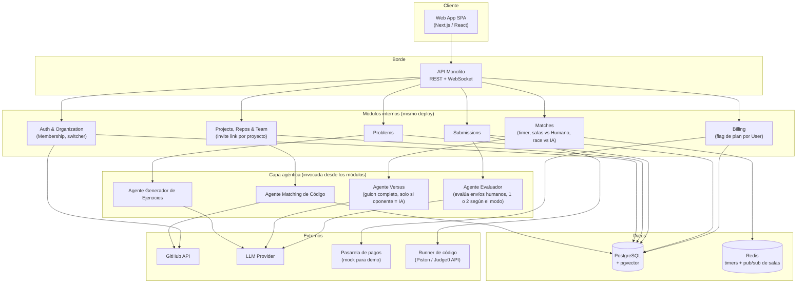

---

## 3. Diagrama de clases (modelo de dominio — MVP)

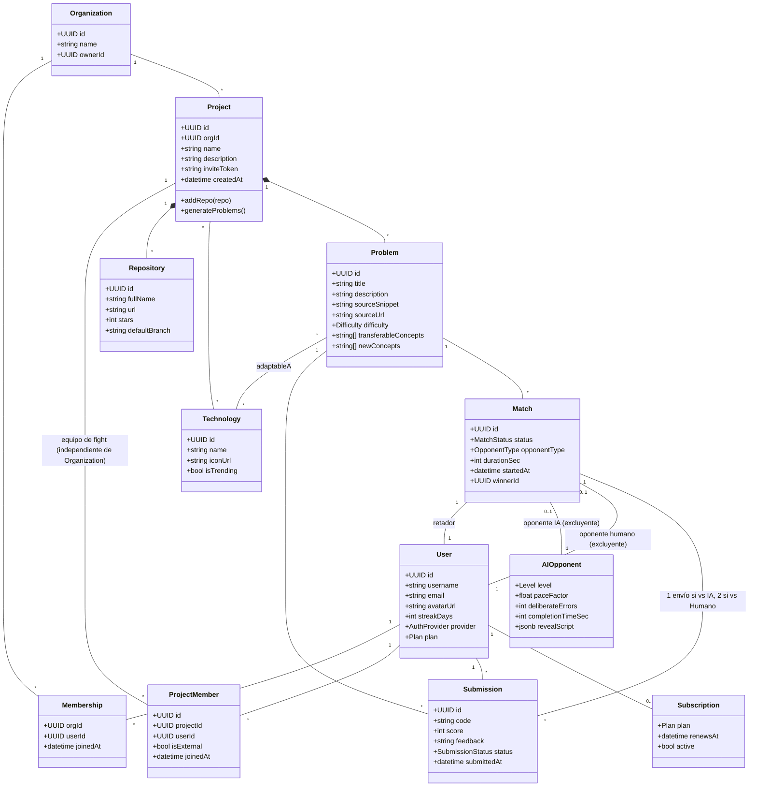

`opponentType` (`ai` | `human`) determina cuál de los dos vínculos opcionales de `Match` aplica. `adaptableA` reemplaza al antiguo `targetTech` único: un `Problem` puede apuntar a varias `Technology` de las seleccionadas en el `Project`.

---

## 4. Secuencia — Creación de proyecto y generación de problemas

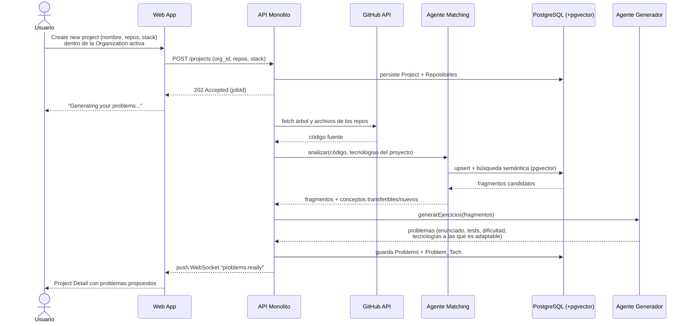

---

## 5. Secuencia — Modo Code

Sin cambios respecto a v3.

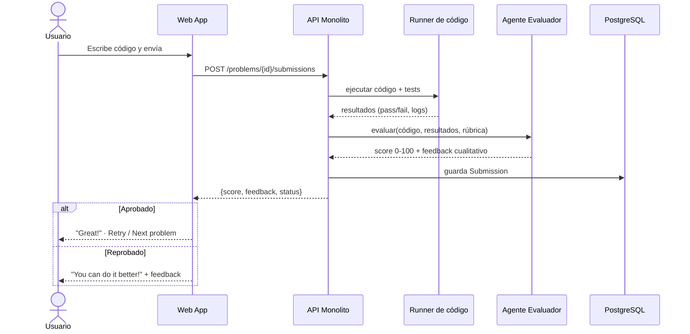

---

## 6a. Secuencia — Modo Fight vs. IA

Sin cambios respecto a v3.

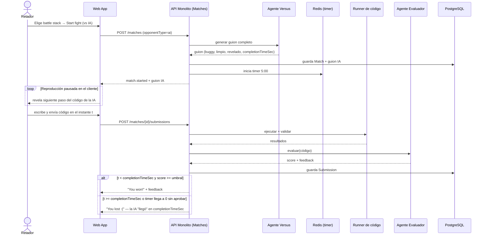

---

## 6b. Secuencia — Modo Fight vs. Humano (en vivo)

Sin cambios respecto a v3.

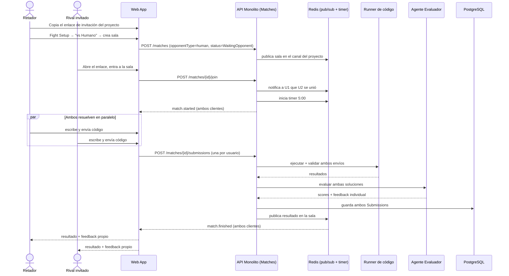

---

## 7. Máquina de estados de un Match

Sin cambios respecto a v3.

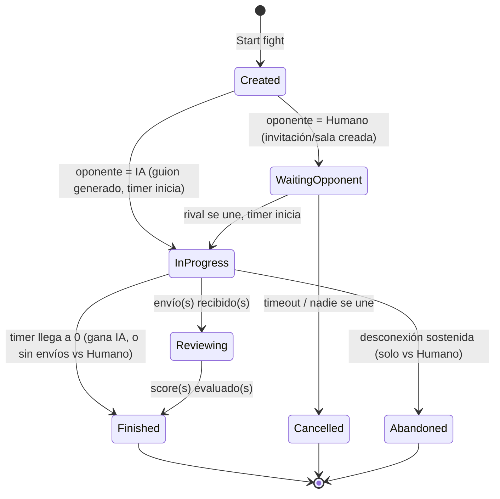

---

## 8. Máquina de estados de un Problem

Sin cambios respecto a v3.

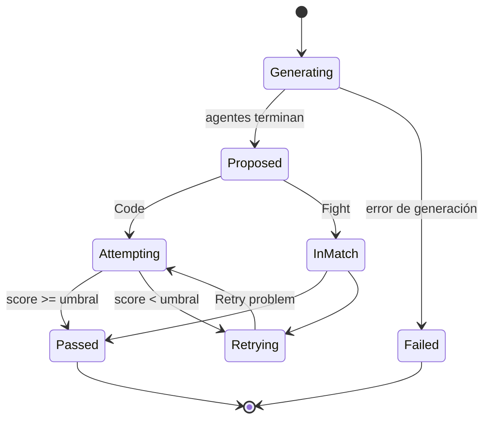

---

## 9. Modelo entidad-relación (persistencia — MVP)

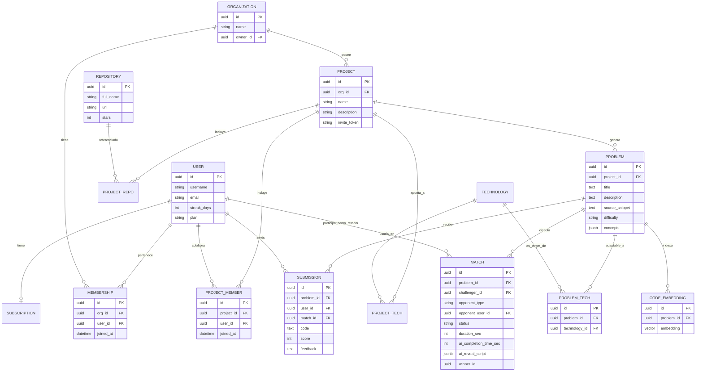

`target_tech_id` desaparece de `PROBLEM` — reemplazado por la tabla puente `PROBLEM_TECH`.

---

## 10. Vista de despliegue (MVP)

Sin cambios respecto a v3.

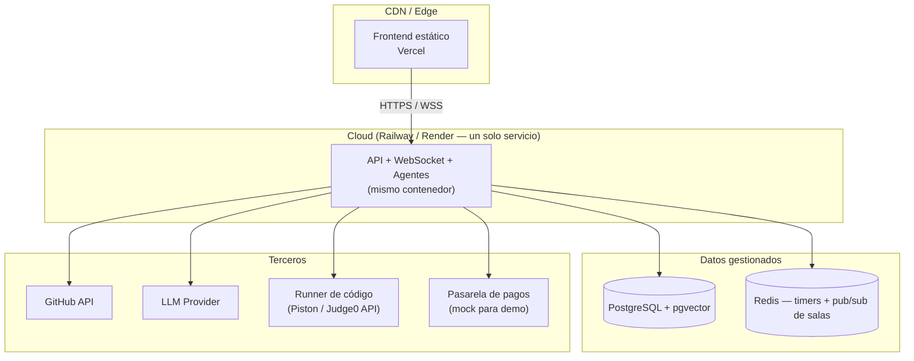

---

## 11. Decisiones de arquitectura (ADRs)

| # | Decisión | Motivo |
|---|---|---|
| ADR-01 | Generación de problemas asíncrona con notificación por WebSocket | La pantalla "Generating your problems..." implica latencia de decenas de segundos |
| ADR-02 | Agentes como módulos internos del monolito, no microservicios separados, para Fase 1 | Reduce infraestructura y tiempo de deploy bajo el límite de la hackathon |
| ADR-03 | `pgvector` dentro de Postgres en vez de una Vector DB dedicada, para Fase 1 | Evita levantar y operar un servicio adicional |
| ADR-04 | Runner de código externo (Piston/Judge0) o contenedor único, en vez de sandbox propio | Construir aislamiento serio propio consume tiempo que no se tiene hoy |
| ADR-05 | Redis pub/sub + timers para el modo Fight, soportando tanto vs. IA como vs. Humano | La colaboración vía enlace es parte del plan gratuito; el fight real entre personas es tan MVP como el fight contra IA |
| ADR-06 | `Organization` + `Membership` real (sin roles); un `User` puede pertenecer a varias; cada `Project` pertenece a una `Organization` | El wireframe confirma un selector real de organizaciones, no un label fijo |
| ADR-07 | El Agente Versus se invoca una sola vez por match, antes de iniciar el timer, generando el guion completo | Elimina la dependencia de streaming en vivo del LLM durante el duelo vs. IA |
| ADR-08 | `Community` y `News` quedan fuera de alcance de Fase 1 | No forman parte del diferencial de producto descrito en la propuesta |
| ADR-09 | En el modo vs. Humano, ambas soluciones pasan por Runner + Agente Evaluador sin atajos | No hay guion pregenerado que decida el resultado — el rival es una persona real |
| ADR-10 | `Problem` ↔ `Technology` es muchos-a-muchos ("Adaptable a") en vez de un único `targetTech` | El wireframe muestra varios íconos de tecnología por problema: un mismo ejercicio puede resolverse en más de una tecnología seleccionada para el proyecto |
| ADR-11 | `ProjectMember` (equipo de fight) se modela independiente de `Organization`/`Membership` | Evita acoplar dos conceptos que el wireframe no confirma como iguales; se puede unificar después si el negocio lo requiere |
