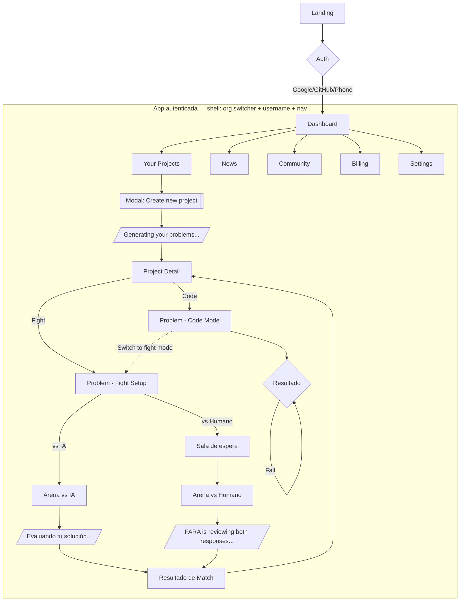

# FARA — Arquitectura de Contenido y Mapa del Sitio

Documento complementario a `FARA_Arquitectura_v5.md`. Ese documento describe el **sistema** (dominio, servicios, datos). Este describe el **contenido y la navegación**: qué hay en cada pantalla, en qué estados puede estar, y cómo se conectan entre sí. Está pensado para poder pegarlo (o el prompt de la sección 7) directamente en una IA generadora de UI/flujos y que el resultado no se desvíe del wireframe original.

Fuente: wireframes del tablero de Miro "UNICODE - HACKATHON".

---

## 0. Cómo leer este documento

Cada pantalla se describe con la misma ficha:

- **Ruta sugerida** — para que la IA genere rutas consistentes.
- **Objetivo** — qué problema del usuario resuelve esa pantalla.
- **Bloques de contenido** — qué hay, de arriba hacia abajo / izquierda a derecha.
- **Estados** — variantes que la misma pantalla puede mostrar.
- **Acciones primarias / secundarias** — qué botones importan y qué disparan.
- **Entra desde / Sale hacia** — para reconstruir el mapa de navegación.

---

## 1. Principios de arquitectura de la información

1. **Zona pública vs. zona autenticada.** Solo `Landing` y el flujo de auth son públicos. Todo lo demás vive dentro de un *app shell* persistente.
2. **Shell persistente de 3 elementos fijos**, presentes en toda pantalla autenticada:
   - Selector de `Organization` ("Renato's org ▾") arriba del todo.
   - Identidad del usuario (avatar + `username`).
   - Navegación primaria de 7 ítems: `Dashboard · Your projects · News · Community · Billing · Settings`.
3. **Jerarquía de contenido de negocio:** `Organization → Project → Problem → (Submission | Match)`. El sitemap sigue exactamente ese anidamiento.
4. **Patrón "resultado" reutilizado.** Tanto el modo Code como el modo Fight terminan en una pantalla de resultado con la misma anatomía (veredicto + calificación + feedback + acciones de reintento). Conviene pedirle a la IA que lo trate como **un solo componente**, no dos.
5. **Patrón "generando..." reutilizado.** Tres momentos distintos comparten el mismo lenguaje visual (ícono de estrellas + barra de progreso + texto en gerundio): crear proyecto, generar problemas, evaluar un match. También conviene tratarlo como un solo componente de loading.
6. **Contenido de relleno vs. contenido real.** Varias pantallas del wireframe tienen texto de placeholder (`dfweknjfiwebhjfhjbwefjkewkjnfjkneswfjkne`, descripciones lorem, el chiste de Spider-Man en Community). Al pedirle el flujo a una IA, hay que aclarar explícitamente cuáles textos son placeholders a reemplazar y cuáles son copy final (títulos, labels de botones, nombres de planes).

---

## 2. Mapa del sitio

```
Landing (pública)                                            /
├─ Sign in with Google
├─ Sign in with GitHub
└─ Sign in with Phone
   │
   ▼
App autenticada (shell persistente: org switcher + nav)      /app
│
├─ Dashboard                                                 /app/dashboard
│
├─ Your Projects                                             /app/projects
│  ├─ [Modal] Create new project                             /app/projects/new
│  │    └─ Generating your problems... (loading)
│  └─ Project Detail                                         /app/projects/:projectId
│     │
│     ├─ Problem · Code Mode                                 /app/projects/:projectId/problems/:problemId/code
│     │    └─ Resultado (Great! / You can do it better)
│     │
│     └─ Problem · Fight Setup                                /app/projects/:projectId/problems/:problemId/fight
│          ├─ Arena vs. IA                                    /app/matches/:matchId
│          │    └─ Resultado (You won! / You lost :()
│          └─ Arena vs. Humano                                /app/matches/:matchId
│               ├─ Sala de espera ("sending invitation")
│               ├─ Evaluando ambas soluciones (loading)
│               └─ Resultado (You won! / You lost :() — con feedback para ambos jugadores
│
├─ News                                                        /app/news
├─ Community                                                   /app/community
├─ Billing                                                     /app/billing
└─ Settings — sin wireframe, ver sección 6                     /app/settings
```

### 2.1 Versión diagrama (Mermaid)



---

## 3. Inventario de contenido por pantalla

### 3.1 Landing
- **Ruta:** `/`
- **Objetivo:** presentar el producto y llevar al login/registro.
- **Bloques:** header (Logo · Log In · Sign In) + hero "landing" (placeholder de propuesta de valor).
- **Estados:** único.
- **Acciones primarias:** Log In, Sign In.
- **Entra desde:** tráfico externo. **Sale hacia:** selección de proveedor de auth.

### 3.2 Selección de proveedor de auth
- **Ruta:** `/login`
- **Objetivo:** autenticar al usuario.
- **Bloques:** tres opciones — Sign in with Google / GitHub / Phone.
- **Estados:** único (falta wireframe de error de login).
- **Sale hacia:** Dashboard, ya dentro del shell con `Organization` activa.

### 3.3 Dashboard
- **Ruta:** `/app/dashboard`
- **Objetivo:** vista de resumen y bienvenida ("Bienvenido *username*", racha de días).
- **Bloques:**
  1. Saludo + racha ("¡Llevas una racha de X días!").
  2. Gráfico de barras de actividad (placeholder).
  3. "Últimos proyectos" — 3 tarjetas.
  4. "Tecnologías aprendidas este mes" — bloque de texto/lista.
- **Estados:** único.
- **Acciones:** ninguna acción primaria explícita; navegación via sidebar.
- **Entra desde:** login, o click en "Dashboard" del nav. **Sale hacia:** Your Projects (vía tarjetas de "últimos proyectos" o nav).

### 3.4 Your Projects (listado)
- **Ruta:** `/app/projects`
- **Objetivo:** ver y filtrar todos los proyectos, o crear uno nuevo.
- **Bloques:**
  1. Título "Projects" + subtítulo "Put your capacities into action".
  2. Panel de filtros: `repo stars`, `technologies`, `premium`.
  3. Grilla de tarjetas de proyecto: repo de GitHub vinculado, `Project_name`, íconos de tecnología (rayo/Docker/Go), fecha.
  4. Botón "+ New project" (arriba a la derecha).
- **Estados:** con proyectos / vacío (no wireframeado, considerar un empty state).
- **Acciones primarias:** New project. **Secundarias:** abrir un proyecto, menú "⋮" por tarjeta (no detallado — probablemente editar/eliminar).
- **Entra desde:** Dashboard, nav. **Sale hacia:** modal Create new project, o Project Detail.

### 3.5 Modal — Create new project
- **Ruta:** overlay sobre `/app/projects` (o `/app/projects/new`)
- **Objetivo:** capturar los datos para generar los problemas de práctica.
- **Bloques:** campos `Project name`, `Description (Optional)`, `Add your GitHub repos` (dropdown), selector de `Technologies` (dos filas: "Newest on the industry" y "Other technologies", cada ícono seleccionable).
- **Estados:** formulario vacío / validando.
- **Acciones primarias:** Create project. **Secundarias:** Cancel.
- **Sale hacia:** loading "Generating your problems..." → Project Detail.

### 3.6 Loading — Generating your problems...
- **Objetivo:** comunicar que hay un proceso asíncrono (agentes generando ejercicios) en curso.
- **Bloques:** ícono de estrellas + barra de progreso + texto "Generating your problems...".
- **Estados:** en progreso → completado (transición automática, no requiere acción del usuario) → error (no wireframeado).
- **Nota:** mismo componente visual que el loading de "FARA is reviewing both responses..." (sección 3.10).

### 3.7 Project Detail
- **Ruta:** `/app/projects/:projectId`
- **Objetivo:** ver los repos vinculados, el equipo y los problemas generados; entrar a resolverlos.
- **Bloques:**
  1. Header: `Project_name` (editable, ícono lápiz) + tabs de `Github repos` vinculados.
  2. Panel "Problemas propuestos": lista de tarjetas de problema, cada una con:
     - Fuente (link a GitHub: repo + snippet de código de origen).
     - "Adaptable a" + íconos de tecnologías aplicables (many-to-many).
     - Botones **Code** y **Fight**.
  3. Panel lateral "Your Team": lista de miembros (`ProjectMember`, pueden ser externos) + botón "Compartir" (enlace de invitación).
- **Estados:** problemas listos / (llegando desde el loading de 3.6).
- **Acciones primarias:** Code, Fight (por problema). **Secundarias:** Compartir invitación.
- **Entra desde:** listado de proyectos, o loading de generación. **Sale hacia:** Code Mode, Fight Setup.

### 3.8 Problem — Code Mode
- **Ruta:** `/app/projects/:projectId/problems/:problemId/code`
- **Objetivo:** resolver el problema individualmente con feedback automático.
- **Bloques:**
  1. `Problem_name` + fuente (link GitHub) + `Problem_description`.
  2. Editor "Solve": tabs de stack de batalla (rayo/Docker/Go) + textarea de código con placeholder `#Write your code here!`.
  3. Panel "Checker" (a la derecha del editor).
- **Estados del panel Checker:**
  - *Idle* (antes de enviar).
  - *Generating* (estrellas + barra de progreso, "Generating your problems..." reutilizado o un texto propio de evaluación).
  - *Success* — check verde, "Great!", `Qualification: 90/100`, feedback cualitativo.
  - *Fail* — X roja, "You can do it better!", `Qualification: 30/100`, feedback cualitativo.
- **Acciones primarias:** Submit (envía el código). **Secundarias:** Switch to fight mode, Retry problem, Next problem / Harder problem (cambia según el resultado).
- **Entra desde:** Project Detail. **Sale hacia:** Fight Setup (switch), o vuelve a Project Detail.

### 3.9 Problem — Fight Setup
- **Ruta:** `/app/projects/:projectId/problems/:problemId/fight`
- **Objetivo:** configurar un duelo de código antes de arrancar el timer.
- **Bloques:**
  1. `Problem_name` + fuente + `Problem_description` (idéntico a Code Mode).
  2. "Choose your opponent": lista de usuarios en línea (`Tralalero tralala` ×3 en el wireframe — placeholder) o, implícitamente, la opción de enfrentar a la IA.
  3. "Choose the battle stack": íconos de tecnología seleccionables.
- **Estados:** formulario / "Wait a moment, we're sending the invitation to your opponent" (esperando confirmación del rival humano).
- **Acciones primarias:** Start fight.
- **Entra desde:** Project Detail, o Code Mode (switch). **Sale hacia:** Arena vs IA o Sala de espera → Arena vs Humano.

### 3.10 Arena — vs. IA
- **Objetivo:** duelo en tiempo real contra un guion de IA pregenerado, con timer.
- **Bloques:** mismo layout que Code Mode (problema + editor), más un **timer visible ("5:00")** y reproducción pausada del avance simulado de la IA.
- **Acciones primarias:** Submit.
- **Sale hacia:** loading "Evaluando tu solución..." → Resultado.

### 3.11 Arena — vs. Humano
- **Objetivo:** duelo en tiempo real contra otro usuario, ambos resolviendo en paralelo.
- **Bloques:** dos columnas espejadas — cada jugador ve su propio panel "Problem_name / Solve" con timer compartido.
- **Estados:** Sala de espera → En progreso → "FARA is reviewing both responses..." (loading, ícono de estrellas).
- **Sale hacia:** Resultado (uno por jugador, con feedback cruzado).

### 3.12 Resultado (patrón compartido: Code, Fight vs IA, Fight vs Humano)
- **Objetivo:** comunicar veredicto y dar próximos pasos.
- **Bloques:**
  - Ícono de veredicto: check verde ("You won!") o X roja ("You lost :(").
  - `Your qualification: X/100` y, si aplica, `Username_friend qualification: Y/100`.
  - Dos columnas "FEEDBACK for you" / "FEEDBACK for `username`" (solo en modo Fight vs Humano; en Code y Fight vs IA es una sola columna).
- **Acciones:** Retry problem, Next problem (Code) / vuelta a Project Detail (Fight).
- **Nota para la IA:** modelar como **un solo componente de resultado** con props `mode: solo | duelo` y `outcome: won | lost`, no como 4 pantallas separadas.

### 3.13 News
- **Ruta:** `/app/news`
- **Objetivo:** mostrar tendencias/noticias de tecnología.
- **Bloques:** título + subtítulo "Discover the new tendences of technology day by day" + tarjeta de artículo (imagen + título + resumen + "See full note in web").
- **Estados:** el wireframe solo muestra un artículo — falta definir si es un feed/listado o un artículo destacado + listado debajo.
- **Acciones:** "See full note in web" (abre fuente externa).

### 3.14 Community
- **Ruta:** `/app/community`
- **Objetivo:** feed social entre usuarios de la plataforma.
- **Bloques:** título + subtítulo + un post de ejemplo (autor, texto, área de contenido multimedia vacía, acciones Share / Comments / Likes).
- **Estados:** el wireframe solo muestra un post — falta definir si hay composer para publicar, feed infinito, filtros, etc.

### 3.15 Billing
- **Ruta:** `/app/billing`
- **Objetivo:** mostrar y comparar los planes de suscripción.
- **Bloques:** título "Discover the prices we have for you" + subtítulo + dos tarjetas de plan:
  - **NPC** — $0/month — proyectos y tecnologías simultáneas limitadas, colaboración limitada, enfrentamientos solo contra el equipo propio.
  - **Giga Chad** — $10/month — proyectos y tecnologías ilimitadas, colaboración sin límite, enfrentamientos contra IA.
  - Botón "Comparar planes" (despliega una tabla comparativa más detallada — mencionada en una nota del wireframe pero no dibujada).
- **Estados:** falta el flujo de checkout/pago en sí (mock según ADR-04 de FARA_Arquitectura_v5).

### 3.16 Settings
- Mencionado en el nav en todas las pantallas, **sin wireframe propio**. Ver huecos (sección 6).

---

## 4. Componentes de contenido reutilizables

| Componente | Dónde aparece | Notas para la IA |
|---|---|---|
| Shell / Sidebar nav | Todas las pantallas autenticadas | Org switcher + avatar + 6 links fijos; debe persistir en cada ruta |
| Tarjeta de proyecto | Your Projects, Dashboard | Repo, nombre, íconos de stack, fecha |
| Tarjeta de problema | Project Detail | Fuente, snippet de origen, íconos "adaptable a", botones Code/Fight |
| Panel Checker | Code Mode | 4 estados: idle, generando, éxito, fallo |
| Loading "generando" | Create project, Problem generation, Match evaluation | Mismo lenguaje visual (estrellas + barra) en los 3 casos |
| Panel de resultado | Code, Fight vs IA, Fight vs Humano | Ver 3.12 — un solo componente parametrizable |
| Tarjeta de plan | Billing | Precio, lista de features, plan actual resaltado |

---

## 5. Catálogo de estados transversales

| Entidad de contenido | Estados observados en el wireframe |
|---|---|
| Generación de problemas de un proyecto | Generating → Proposed |
| Envío de código (Checker) | Idle → Generating → Success \| Fail |
| Match (Fight) | Fight Setup → Sala de espera (solo vs Humano) → En progreso → Evaluando → Resultado |
| Plan de usuario | NPC (free) ↔ Giga Chad (pago) |

---

## 6. Huecos a resolver antes de pedirle el flujo completo a una IA

Estos puntos **no** están resueltos en el wireframe. Conviene decidirlos (o marcarlos como "a criterio de la IA") antes de generar el flujo, para no recibir suposiciones inconsistentes:

1. **Settings** — no hay wireframe. ¿Qué contiene: perfil, notificaciones, integraciones de GitHub, cierre de sesión?
2. **Community** — ¿es un feed cronológico? ¿tiene composer de post, comentarios anidados, perfil de otros usuarios?
3. **News** — ¿es un listado de artículos o un solo destacado? ¿contenido propio o agregado de fuentes externas?
4. **Billing** — falta el detalle de la "tabla comparativa" que menciona el wireframe, y el flujo de checkout/pago.
5. **Empty states** — ningún wireframe muestra "sin proyectos", "sin problemas", "sin miembros en el equipo".
6. **Errores** — no hay wireframe de error de login, de generación fallida, ni de desconexión durante un Fight vs Humano.
7. **Elegir oponente IA vs. Humano** — en el wireframe de Fight Setup solo se ven usuarios humanos ("Tralalero tralala" ×3); no queda explícito el control para elegir IA como oponente en esa misma pantalla.

---

## 7. Prompt listo para pedirle el flujo a una IA

Bloque copiable. Reemplazar `[...]` según se resuelvan los huecos de la sección 6.

```
Actúa como diseñador de producto/UX y genera el flujo de navegación completo de "FARA",
una plataforma donde los usuarios practican programación con problemas generados a partir
de sus propios repos de GitHub, ya sea en solitario ("Code mode") o en duelo contra otra
persona o contra una IA ("Fight mode").

Usa exactamente esta jerarquía de contenido: Organization > Project > Problem > (Submission | Match).

Sitemap a respetar (no agregues ni quites pantallas de nivel superior):
- Landing (pública) → selección de proveedor de auth (Google / GitHub / Phone)
- App autenticada, con un shell persistente (selector de organización + usuario + nav:
  Dashboard, Your projects, News, Community, Billing, Settings)
  - Dashboard: racha de días, gráfico de actividad, últimos proyectos, tecnologías aprendidas
  - Your Projects: listado con filtros (repo stars, technologies, premium) + botón New project
    - Modal Create new project (nombre, descripción, repos de GitHub, tecnologías) → loading
      "Generating your problems..." → Project Detail
    - Project Detail: repos vinculados, panel "Your Team" con enlace de invitación,
      lista de problemas propuestos (cada uno con botones Code y Fight)
      - Code Mode: editor + panel Checker (idle/generando/éxito/fallo) → Resultado
        (calificación + feedback + Retry/Next problem)
      - Fight Setup: elegir oponente (IA o humano) + elegir stack → Start fight
        - Arena vs IA: editor + timer 5:00 → evaluación → Resultado
        - Arena vs Humano: sala de espera → editor en paralelo con timer compartido →
          evaluación de ambas soluciones → Resultado con feedback para ambos jugadores
  - News: artículo(s) de tendencias tecnológicas
  - Community: feed social entre usuarios
  - Billing: comparación de planes NPC ($0) vs Giga Chad ($10)
  - Settings: [definir contenido — no hay wireframe de referencia, propone una versión razonable]

Reglas de diseño de contenido a respetar:
1. El panel de "Resultado" (Code, Fight vs IA, Fight vs Humano) debe ser UN SOLO componente
   parametrizable por modo (solo/duelo) y desenlace (ganó/perdió), no pantallas separadas.
2. Los tres momentos de carga asíncrona (crear proyecto, generar problemas, evaluar un match)
   deben compartir el mismo componente visual de loading.
3. El shell (org switcher + nav) debe persistir en toda ruta autenticada; no debe redibujarse
   distinto entre pantallas.
4. Genera un empty state razonable para: Your Projects sin proyectos, Project Detail sin
   problemas aún generados, y equipo de proyecto sin miembros.
5. [Agregar aquí cualquier resolución específica de los huecos de la sección 6 antes de enviar
   este prompt: qué va en Settings, si Community tiene composer, si News es feed o destacado, etc.]

Entregable esperado: un mapa de navegación (puede ser en Mermaid) + una ficha por pantalla con
sus bloques de contenido, estados y acciones primarias/secundarias, en el mismo formato de
ficha usado en este documento.
```
